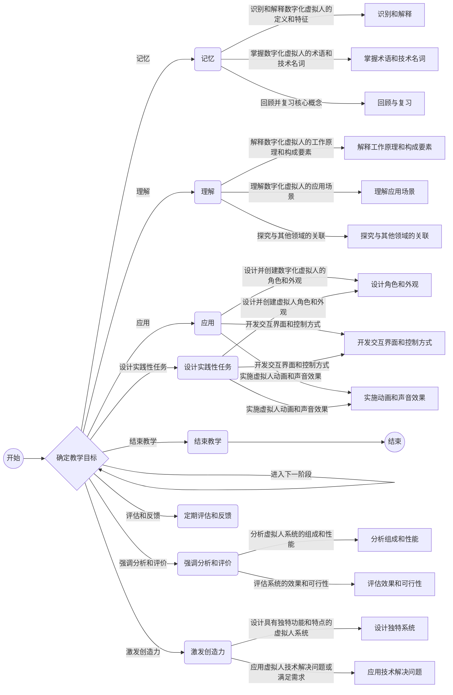

```mermaid
graph LR
    start((开始)) --> determine_objective{确定教学目标}
    determine_objective -- 记忆 --> remember(记忆)
    determine_objective -- 理解 --> understand(理解)
determine_objective -- 应用 --> apply(应用)
determine_objective -- 结束教学 --> jiesu(结束教学)

remember -- 识别和解释数字化虚拟人的定义和特征 --> identify[识别和解释]
  remember -- 掌握数字化虚拟人的术语和技术名词 --> grasp[掌握术语和技术名词]
  remember -- 回顾并复习核心概念 --> review[回顾与复习]
  
  understand -- 解释数字化虚拟人的工作原理和构成要素 --> explain[解释工作原理和构成要素]
  understand -- 理解数字化虚拟人的应用场景 --> comprehend[理解应用场景]
  understand -- 探究与其他领域的关联 --> explore[探究与其他领域的关联]
  
  apply -- 设计并创建数字化虚拟人的角色和外观 --> design[设计角色和外观]
  apply -- 开发交互界面和控制方式 --> develop[开发交互界面和控制方式]
  apply -- 实施虚拟人动画和声音效果 --> implement[实施动画和声音效果]
  
  determine_objective -- 进入下一阶段 --> determine_objective{确定教学目标}
  
  determine_objective -- 设计实践性任务 --> practical(设计实践性任务)
  practical -- 设计并创建虚拟人角色和外观 --> design
  practical -- 开发交互界面和控制方式 --> develop
  practical -- 实施虚拟人动画和声音效果 --> implement
  
  determine_objective -- 强调分析和评价 --> analyze(强调分析和评价)
  analyze -- 分析虚拟人系统的组成和性能 --> analyze_components[分析组成和性能]
  analyze -- 评估系统的效果和可行性 --> evaluate[评估效果和可行性]
  
  determine_objective -- 激发创造力 --> creativity(激发创造力)
  creativity -- 设计具有独特功能和特点的虚拟人系统 --> unique_design[设计独特系统]
  creativity -- 应用虚拟人技术解决问题或满足需求 --> apply_technology[应用技术解决问题]
  
  determine_objective -- 评估和反馈 --> assess(定期评估和反馈)
  jiesu --> stop((结束))

```
